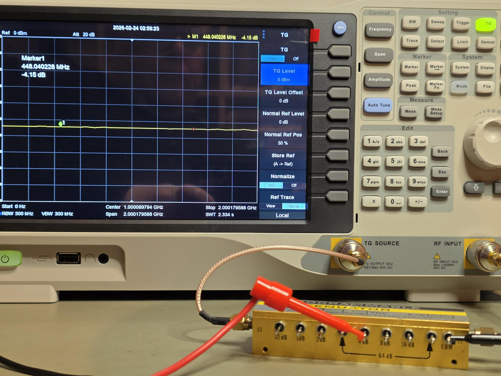

I have take delivery of a Weinschel step attenuator,
which is actuated by 12V relays that can be combined
to make any step between 0 and 127 dB attenuation. 

Today I hooked it up to a power supply and my
spectrum analyzer (and tracking generator) 
to check that it works. 

{width=600px}

And a quick check confirms that all the relays
and individual steps work, and they do combine 
in the way one should expect. So the attenuator
is healthy. According to the datasheet, the 
attenuator should work up to 2GHz, which is 
the limit of my spectrum analyzer, and that is
confirmed. Also according to the datasheet,
the relays draw 14 mA each, confirmed in the lab.

My long run goal is to build this into an instrument
with microprocessor and ethernet control. Maybe Easter
can be a time to get some design work done. 
